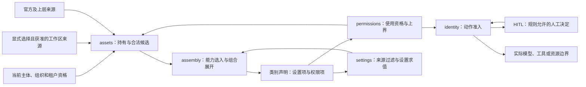

# 资产领域关系

状态为待审技术设计。正式维护位置不授予技术接受、实施或支持；精确公开形状仍待定义。

## 三条求值路径

```mermaid
flowchart LR
  I[当前主体、组织和租户资格] --> A[assets：持有与合法候选]
  W[显式选择且获准的工作区来源] --> A
  O[官方及上层来源] --> A
  P[permissions：使用资格与上界] --> A
  A --> C[assembly：能力选入与组合展开]
  C --> D[类别声明：设置项与权限项]
  D --> S[settings：来源过滤与设置求值]
  D --> P
  S --> C
  P --> G[identity：动作准入]
  G --> H[HITL：规则允许的人工决定]
  H --> G
  G --> E[实际模型、工具或资源边界]
```

图表示协作关系，不表示全部行为由某一循环调用完成。候选筛选前需要共同使用资格；完整装配后才知道其全部属性项。Plugin的成员启用设置影响展开，在该Plugin展开处先取得该值，不能等全部展开后才回算。
