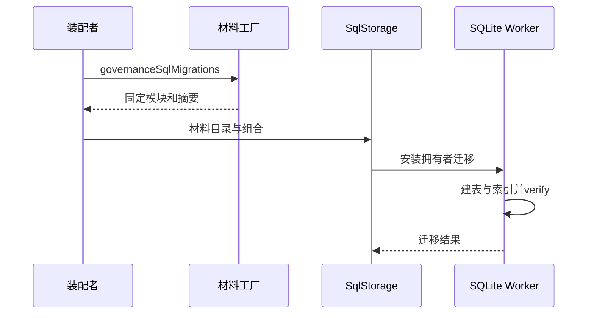

# 关键流程

## 流程

当前可运行的是迁移材料装配。业务贡献与采用流程仍在实现。

```mermaid
sequenceDiagram
  participant A as 装配者
  participant M as 材料工厂
  participant S as SqlStorage
  participant W as SQLite Worker
  A->>M: governanceSqlMigrations
  M-->>A: 固定模块和摘要
  A->>S: 材料目录与组合
  S->>W: 安装拥有者迁移
  W->>W: 建表与索引并verify
  W-->>S: 迁移结果
```

## 失败与生命周期

材料文件缺失不能静默变成空迁移。数据库约束失败使所在事务失败。重开读取同一数据库不重新创建已有关系；迁移的版本与摘要由 SqlStorage 认回。业务 unknown、seal、reserve 和 fiber 卸载的完整流程由后续 Provider 补齐，不由本迁移测试证明。
