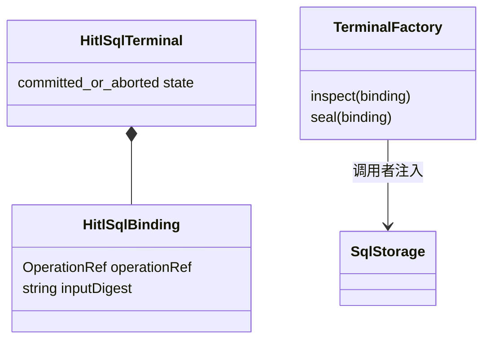

# 对象模型

## 对象与关系

```mermaid
classDiagram
  class HitlSqlBinding {
    OperationRef operationRef
    string inputDigest
  }
  class HitlSqlTerminal {
    committed_or_aborted state
  }
  class TerminalFactory {
    inspect(binding)
    seal(binding)
  }
  class SqlStorage
  HitlSqlTerminal *-- HitlSqlBinding
  TerminalFactory --> SqlStorage : 调用者注入
```

Binding 是原操作值，不是权限凭据。Terminal 是耐久结果。工厂对象仅保管装配配置，不建立第二份内存权威。

## 生命周期

操作无终态时，consume 或 seal 可在事务中创建终态。已有终态不可反转。终态由 SQL 持久保管，工厂对象丢弃不删除记录，也不关闭外部提供的存储。查询不可将缺记录推断为撤销。
