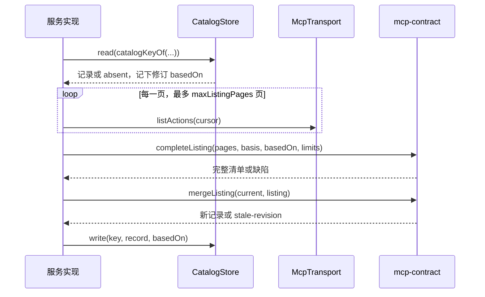

# 关键流程

本包自己不运行流程，它给出流程里的纯步骤。下面是服务实现刷新清单时调用本包函数的次序。前提：服务实现已核采用与资格（SPEC S1）。

## 流程

```mermaid
sequenceDiagram
    participant S as 服务实现
    participant C as CatalogStore
    participant T as McpTransport
    participant K as mcp-contract
    S->>C: read(catalogKeyOf(...))
    C-->>S: 记录或 absent，记下修订 basedOn
    loop 每一页，最多 maxListingPages 页
        S->>T: listActions(cursor)
    end
    S->>K: completeListing(pages, basis, basedOn, limits)
    K-->>S: 完整清单或缺陷
    S->>K: mergeListing(current, listing)
    K-->>S: 新记录或 stale-revision
    S->>C: write(key, record, basedOn)
```

## 失败与生命周期

任一页失败、缺陷或修订不符时，服务保留原采用（SPEC S5）。本包的函数不持有资源，不需要取消或释放。
