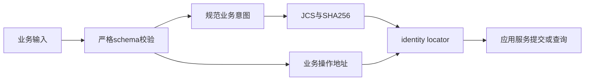

# 协议校验与原操作定位

可信适配器提供调用上下文，调用者提供业务声明。schema验证数据形状，应用服务仍须判断当前权限与业务前提。

```mermaid
flowchart LR
  I[业务输入] --> V[严格schema校验]
  V --> C[规范业务意图]
  C --> F[JCS与SHA256]
  V --> A[业务操作地址]
  F --> L[identity locator]
  A --> L
  L --> S[应用服务提交或查询]
```

地址保留operationKey，指纹排除operationKey和requestId。丢失首回执后仍可用原地址和指纹查询。unknown保留不确定性；校验失败不产生业务提交或资源。
