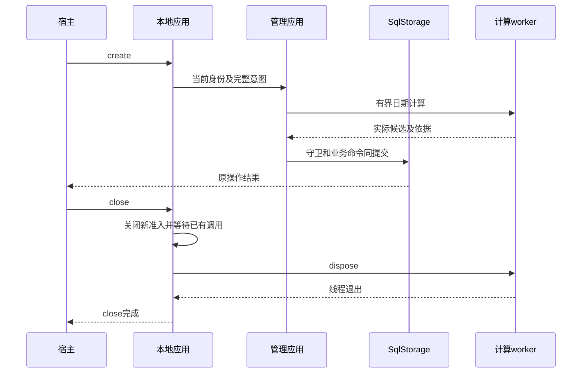

# 构造、调用与关闭

宿主先准备SQL材料和组合登记。应用构造SQL后端、计算worker、预测、管理和查询，只有构造完成才交回公开服务。构造失败等待已分配worker释放，清理也失败时保留两个错误。

```mermaid
sequenceDiagram
  participant H as 宿主
  participant A as 本地应用
  participant M as 管理应用
  participant S as SqlStorage
  participant W as 计算worker
  H->>A: create
  A->>M: 当前身份及完整意图
  M->>W: 有界日期计算
  W-->>M: 实际候选及依据
  M->>S: 守卫和业务命令同提交
  S-->>H: 原操作结果
  H->>A: close
  A->>A: 关闭新准入并等待已有调用
  A->>W: dispose
  W-->>A: 线程退出
  A-->>H: close完成
```

commit或查询不明时保留unknown。应用关闭不取消业务，也不关闭借用的SQL。Cordis依赖恢复创建新实例，读取原持久事实。后台Job扫描和执行不是本流程的实现范围。
