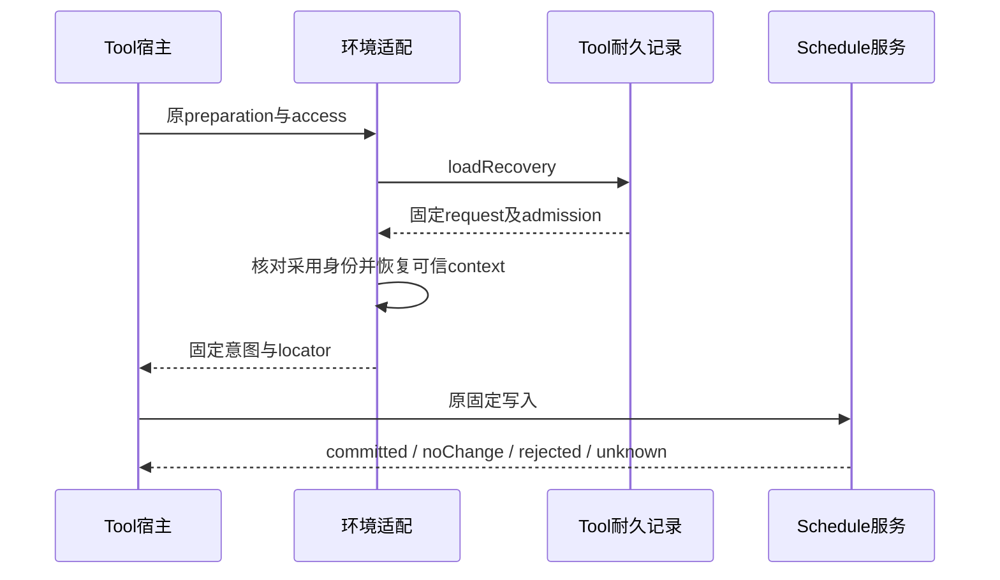

# 关键流程

写入先恢复原调用，再解析完整参数和可信上下文，最后调用业务服务。首次写入与重启后的重放使用同一 locator；业务返回 unknown 时，只交回原身份供查询。

```mermaid
sequenceDiagram
 participant H as Tool宿主
 participant E as 环境适配
 participant T as Tool耐久记录
 participant S as Schedule服务
 H->>E: 原preparation与access
 E->>T: loadRecovery
 T-->>E: 固定request及admission
 E->>E: 核对采用身份并恢复可信context
 E-->>H: 固定意图与locator
 H->>S: 原固定写入
 S-->>H: committed / noChange / rejected / unknown
```

详情读取依次执行 observe、读取固定版本、检查内容与范围、confirm。任何阶段失败都不披露部分旧结果。分页继续使用同一固定版本和披露观察；预算累计跨页生效。
